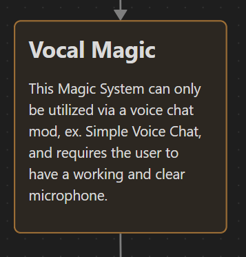

=======

[Demo Video](https://docs.github.com/en/repositories/creating-and-managing-repositories/creating-a-repository-from-a-template).

# Reign Of Sped Dev
## Reign of Sped: Vocal Magic
### A Minecraft Mod focusing on allowing the user to cast spells with a custom vocal language!

<b>

  This Project was a really eye opening experience, I had to relearn my knowledge on Minecraft modding with learning a new version and a completely new Modding Library, NeoForge on Minecraft verision 1.21.1! This is a small addon to my passion project that is Reign of Sped; it dreams to be a large mod with hundred of thousands of players, think of Orespawn of the past! Reign of Sped (RoS) will have technically 6 different magic systems within itself that players can readily use and all interconnect with one another, thousands of different bosses (which even have their own seperate magic system), hundreds of dungeons, thousands of custom mobs, and more!!! 

  As I have been planning and developing RoS for a few years now, I thought why not force myself to actually get started on a new idea and actually have some progress on this project! With there being a multitude of magic systems in my mod, I thought hard on what would be a unique mechanic that would get player's attention, so i thought, why not use the player's voice to cast spells!

  

  One of the hardest parts of this project though was relearning the new modding library NeoForge, previously I had used to use Fabric but seeing how it was generally only for new versions and for lightweight mods, it didn't really fit my goals for RoS, so I switched. Another thing I had to learn was how differently NeoForge handled dependencies compared to normal Java Code, I had to go think and thin just to even get started on the modding, after a few hours and looking though NeoForge Docs, I finally found out how to implement it!

  From all of this trial and error, trial and error, I had got to understand NeoForge in a deeper level, understanding how its dependencies work, how differently it does networking from the client to the server than Fabric, how VOSK (the Speech to Text Library) Works, and even a new Programming Design Pattern; the Builder Pattern!

  I really had alot of fun with this project, definetly alot of ups and down, pain and suffering, but after everything was done (well not everything, but somethings!) I feel very satisfied with my progress and how much my programming skills and understanding have grown.

  
</b>
[Finale Presentation](https://docs.google.com/presentation/d/18yIxv2Fp-OnU3ZRSqfFh6H8iegxag54J-PJLfuuLXVE/edit?usp=sharing).
